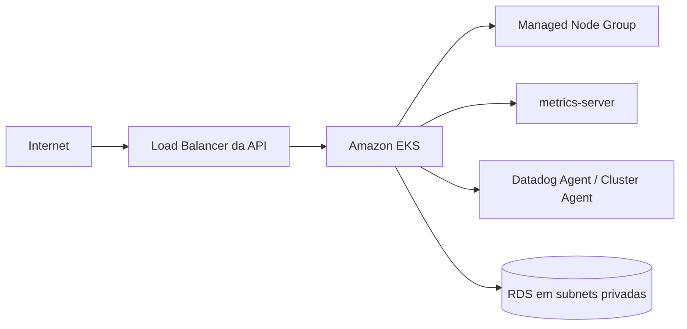

# Oficina Kubernetes Infra

Provisiona a base de execução Kubernetes da Fase 3: VPC, subnets públicas/privadas e Amazon EKS por Terraform. Também instala `metrics-server` e, quando a chave está configurada, o Datadog Agent.

## Stack

Terraform, AWS VPC, Amazon EKS, Kubernetes, Helm e Datadog.

## Arquitetura específica

O ambiente acadêmico não usa NAT Gateway para reduzir custo. O node group roda inicialmente com 1 `t3.medium` e pode crescer para 2 nodes.

## Terraform State

O diretório `bootstrap-state/` cria um bucket S3 versionado, criptografado e bloqueado para acesso público. Execute o workflow **Bootstrap Terraform State** uma vez antes do primeiro deploy.

Variáveis do repositório:

- `AWS_REGION=us-east-1`
- `TF_STATE_BUCKET=<bucket criado pelo bootstrap>`
- `TF_STATE_READY=true`
- `ENABLE_DEPLOY=true` apenas durante o período de deploy

Secrets:

- `AWS_ACCESS_KEY_ID`
- `AWS_SECRET_ACCESS_KEY`
- `DD_API_KEY` (opcional até a etapa de observabilidade)

## CI/CD

Pull Requests executam `terraform fmt` e `terraform validate`. Push/execução manual com as variáveis de deploy habilitadas realiza `terraform apply`, publica os outputs no Summary e configura componentes básicos do cluster.

Outputs importantes:

- `cluster_name`
- `vpc_id`
- `vpc_cidr`
- `private_subnet_ids`
- `public_subnet_ids`
- `node_security_group_id`

## Datadog

O arquivo `k8s/datadog-values.yaml` habilita coleta de logs, APM, kube-state-metrics core e Orchestrator Explorer.

## Swagger / Postman

Este repositório não expõe API própria. A coleção usada na demonstração está em:
https://github.com/YasminLuna/oficina-api/blob/hml/postman/Oficina-Fase3.postman_collection.json
