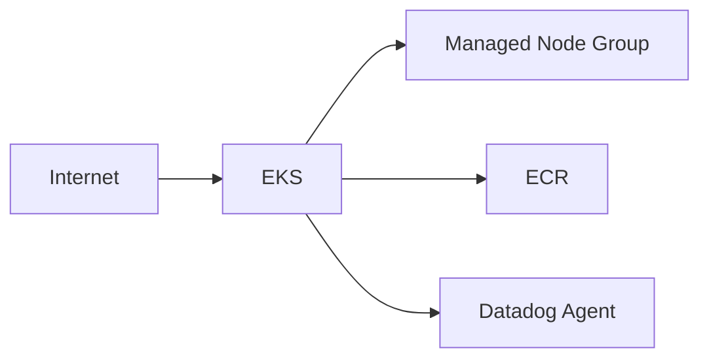

# Oficina Kubernetes Infra

Provisiona VPC, EKS e ECR da aplicação por Terraform. Também contém a configuração de integração do cluster com Datadog.

## Arquitetura específica


## Deploy
```bash
cd terraform
terraform init
terraform validate
terraform plan
terraform apply
aws eks update-kubeconfig --name $(terraform output -raw cluster_name) --region us-east-1
```

## Datadog
```bash
export DD_API_KEY=...
./scripts/install_datadog.sh
```

## CI/CD
PR em `main`: validate/plan. Push em `hml` e `main`: apply automático.
